# Enjoytrip*Final*서울10*전수민*한상우

 

## ⛺CAMPPER

바쁜 일상속 힐링을 찾아 떠나는 캠핑족을 위한 투표 기반 캠핑 서비스 Campper

 

## 🚀 Services

1. 캠핑이 대세인 요즘 어느 캠핑장이 핫할까요?
2. 리뷰와 투표를 기반으로 캠핑장 평가를 확인 할 수 있습니다.
3. 지도를 통해 캠핑장 리뷰를 확인하고 찜할 수 있습니다.

 

## 🤖Pages

| Main                                                  | Login                                                  |
| ----------------------------------------------------- | ------------------------------------------------------ |
| 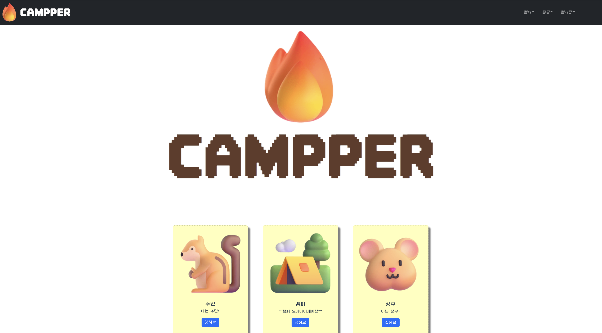 | 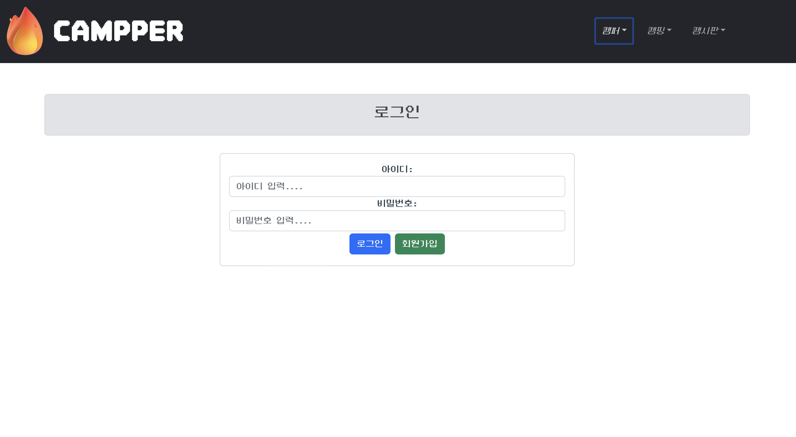 |

| SignUp                                                  | MyPage                                                  |
| ------------------------------------------------------- | ------------------------------------------------------- |
| 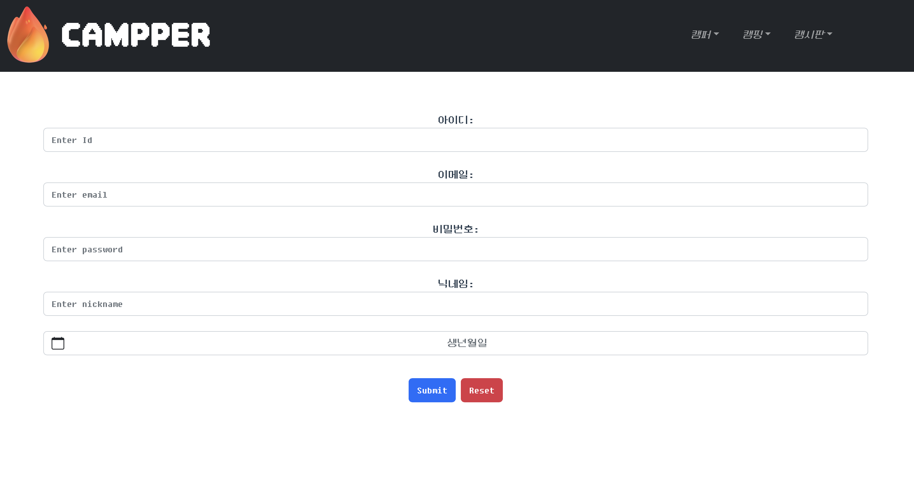 | 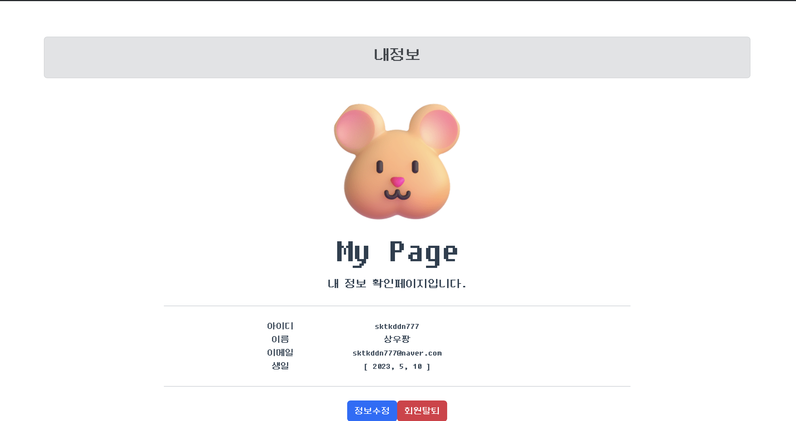 |

| Camping                                                  | Camping-detail                                                  |
| -------------------------------------------------------- | --------------------------------------------------------------- |
| 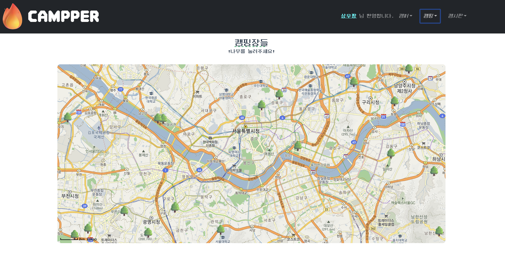 | 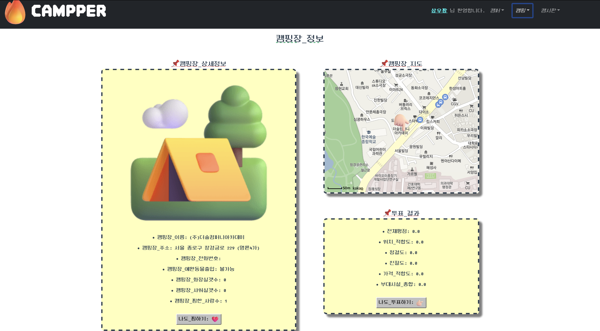 |

| CampingVote                                                   | Board                                                  |
| ------------------------------------------------------------- | ------------------------------------------------------ |
| 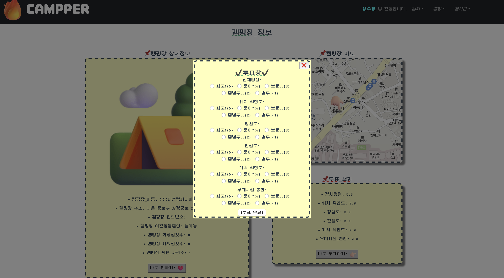 | 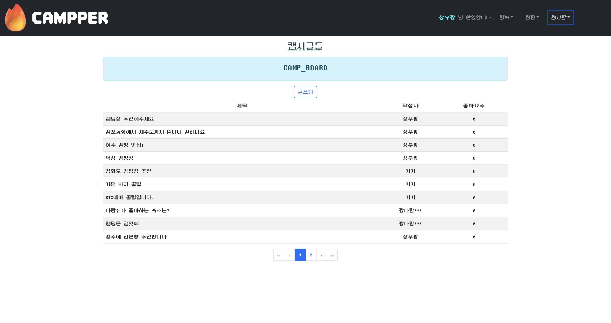 |

| BoardWrite                                                   | BoardDetail                                                   |
| ------------------------------------------------------------ | ------------------------------------------------------------- |
| 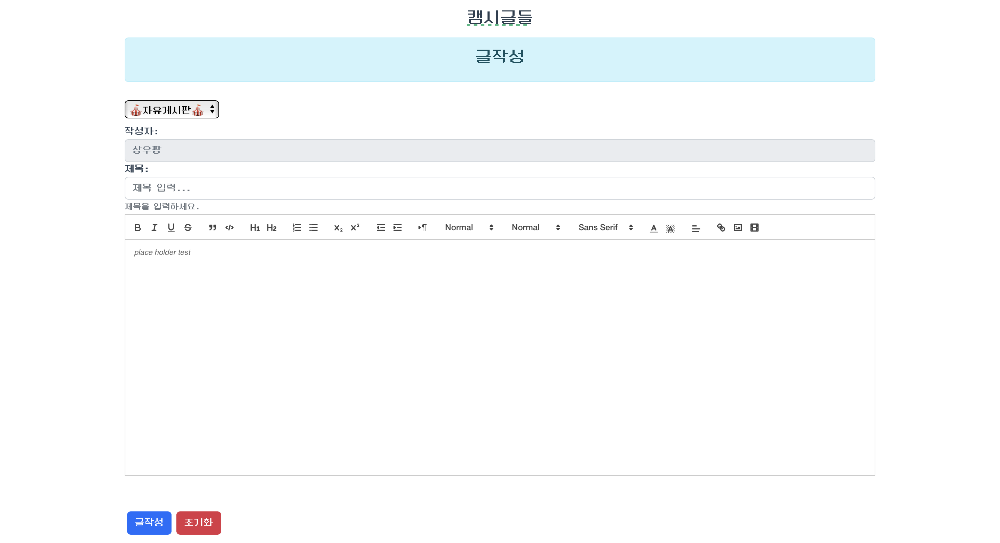 | 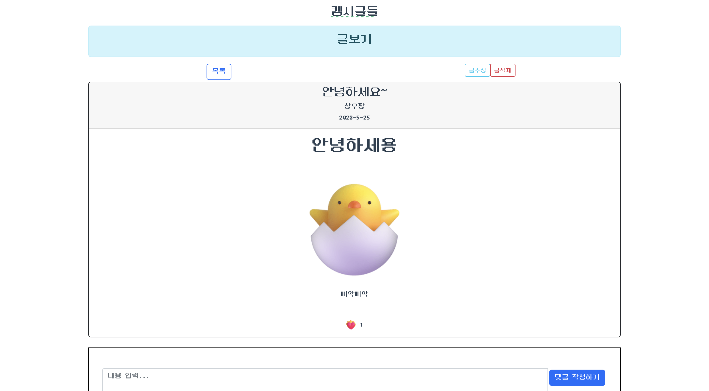 |

 

## 🏢 UsecaseDiagram

 

  
  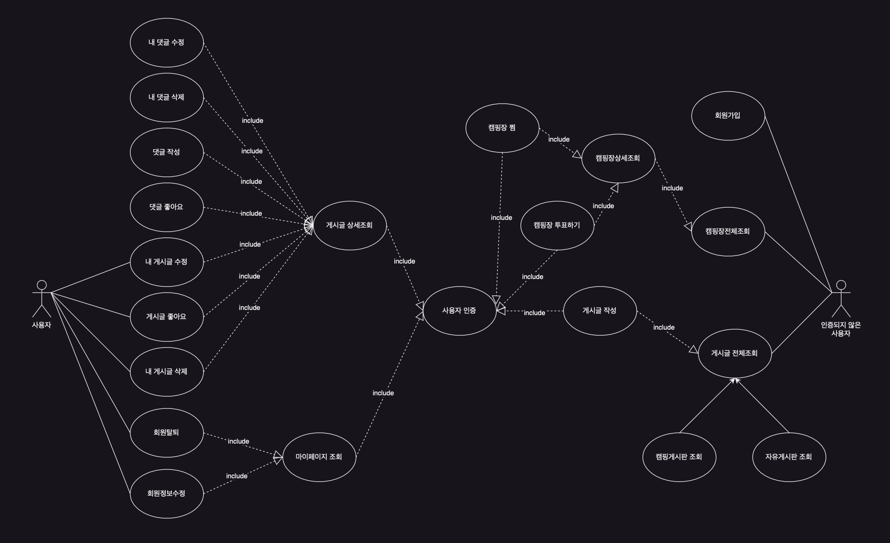

 

## 🏢 ClassDiagram

 

  
  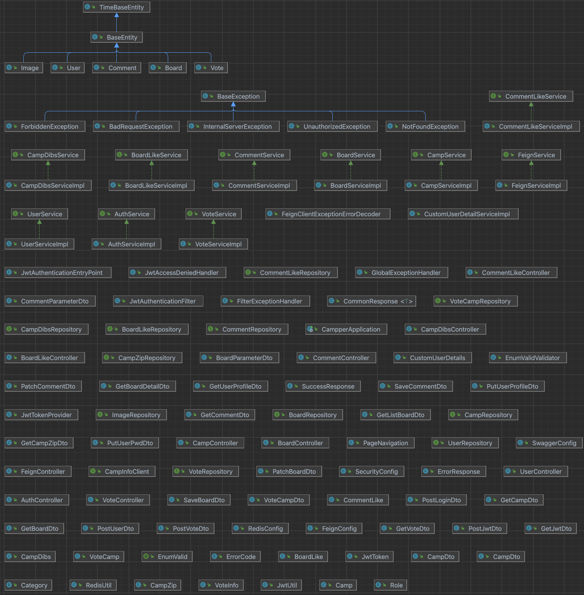

 

## 🏢 ERD

 

  
  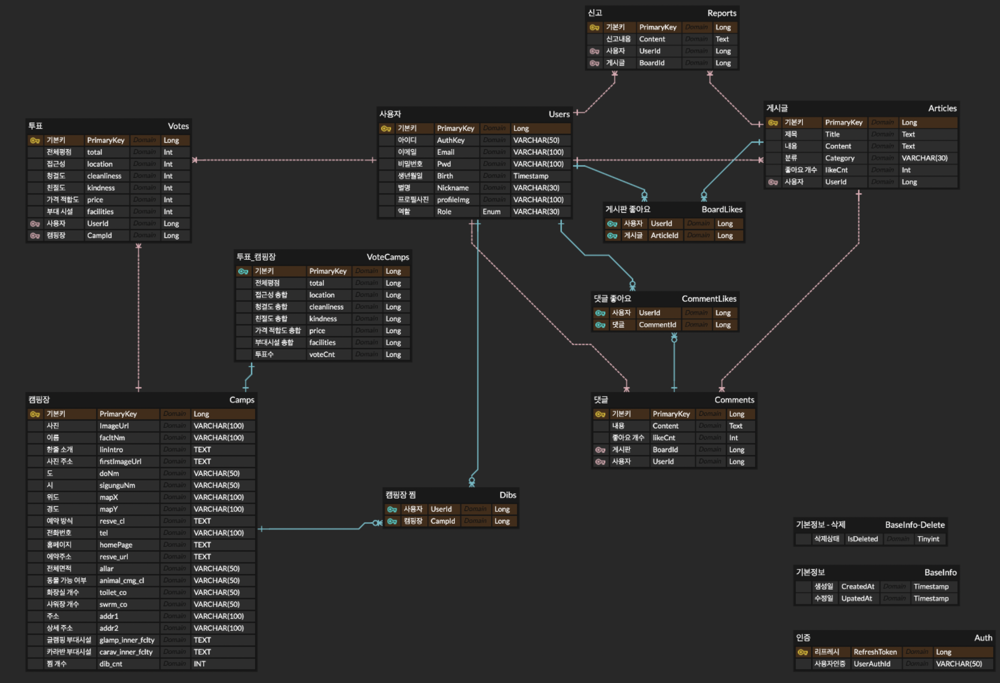

 

## 🔧 Tech stack

 

| 분류     | 기술                                                                                                                                                                                                                                                                                                                                                                                                                                                                                                                       |
| :------- | :------------------------------------------------------------------------------------------------------------------------------------------------------------------------------------------------------------------------------------------------------------------------------------------------------------------------------------------------------------------------------------------------------------------------------------------------------------------------------------------------------------------------- |
| CI/CD    |                                                                                                                                                                                                                                                                                          |
| 개발환경 |                                                                                                                                                                                                                                                                                                                                                                                                                          |
| Frontend |                                                                                                                                                                                                        |
| Backend  |      |
| DB       |                                                                                                                                                                                                                      |

 

## **👨‍👨‍👧‍👦 Members**

 

| 이름   | 소개페이지                                        |
| ------ | ------------------------------------------------- |
| 전수민 | [개인 리포로 이동](https://github.com/squirMM)    |
| 한상우 | [개인 리포로 이동](https://github.com/sktkddn777) |

